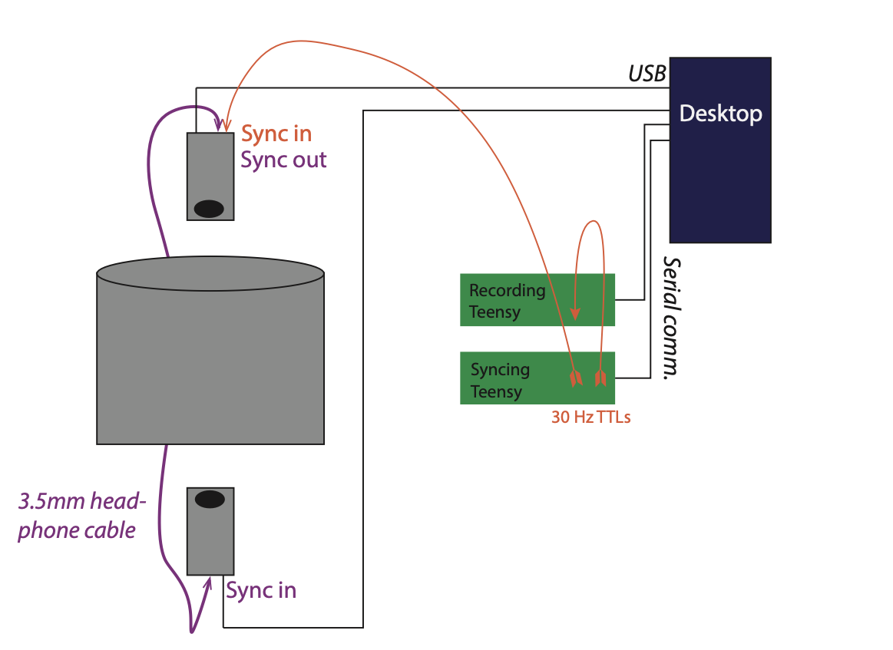

# pyk4a_multicam


## Installation

Install [Anaconda](https://docs.anaconda.com/anaconda/install/index.html) or [Miniconda](https://docs.conda.io/en/latest/miniconda.html). Create and activate an environment called `top_bottom_triggered` with python=3.8:
```
conda create -n top_bottom_triggered python=3.8
conda activate top_bottom_triggered
```

Clone or download this repo and pip install:
```
git clone https://github.com/jonahpearl/pyk4a_multicam/tree/main
pip install -e ./pyk4a_multicam
```

Make the new environment accessible in jupyter 
```
python -m ipykernel install --user --name=top_bottom_triggered
```
